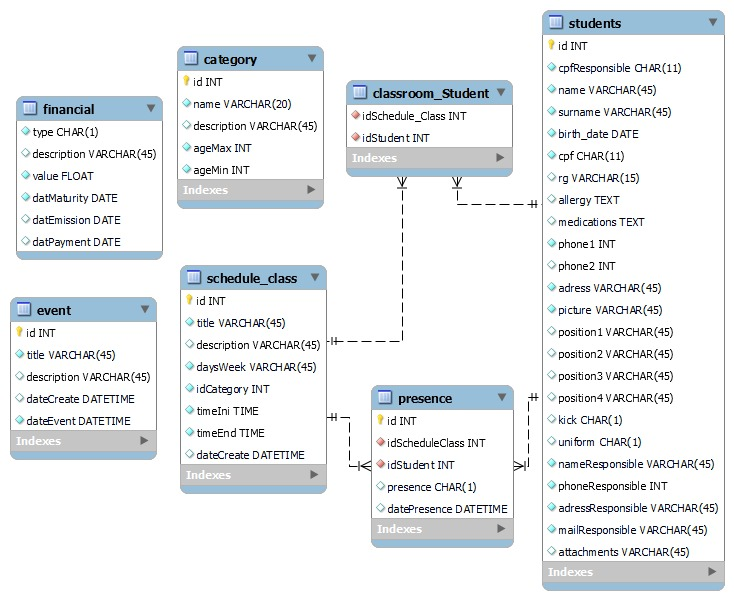

# GolWeb System
## Projeto Integrador Web

O projeto *GolWeb System* nasceu para o gerenciamento de ONGs que atendem como escolinha de futebol.

A adesão é fácil para os usuários que irão administrar e utilizar para marcar as presenças dos alunos.

### Recursos
- Sistema de Autenticação (login, senha e recuperação de senha)
- Dashboard financeiro
- Sistema de Chamadas
- Gestão de Alunos
- Gestão de Categorias
- Gestão de Agenda de Aulas
- Gestão de Finanças
- Gestão de Eventos
- Gestão de Usuários
    - Controle de Acesso de usuários (Admin e Professor)
- Relatórios
    - Alunos x Categorias
    - Alunos x Posição
    - Alunos x Presença
 

### Instalação
Faça uma cópia do arquivo .env.example e renomeie para .env

No arquivo .env altere as cofigurações conforme sua necessidade, vide documentação Laravel.

Instale os pacotes do php e do javascript
```
composer install
npm install
```

Para rodar o projeto utilize o artisan em serviço local e em produção crie um link simbólico para a pasta public no local desejado.
```
php artisan serve
```

### Modelo Relacional



### Tecnologias
- PHP 8
- MariaDB 10
- Composer
- Npm
- HTML
- CSS

### Frameworks
- Laravel 8 https://laravel.com/docs/8.x
- Tailwind https://flowbite.com/
- Flow Bite https://flowbite.com/


### Alunos
- Juliano Da Silva
- Lucas Paixao
- Paulo Cesar Dal Ponte

